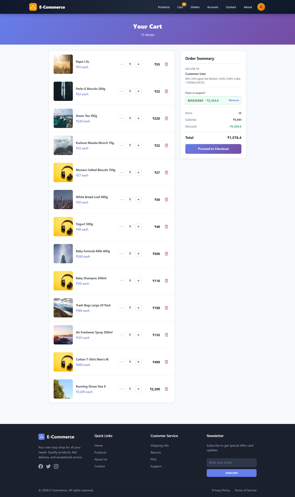
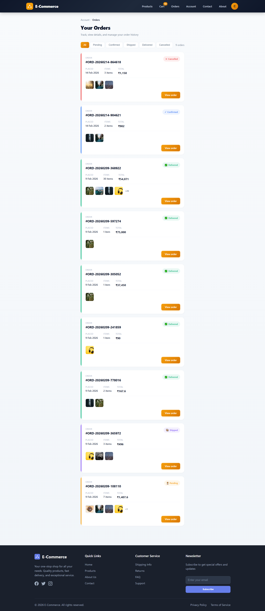
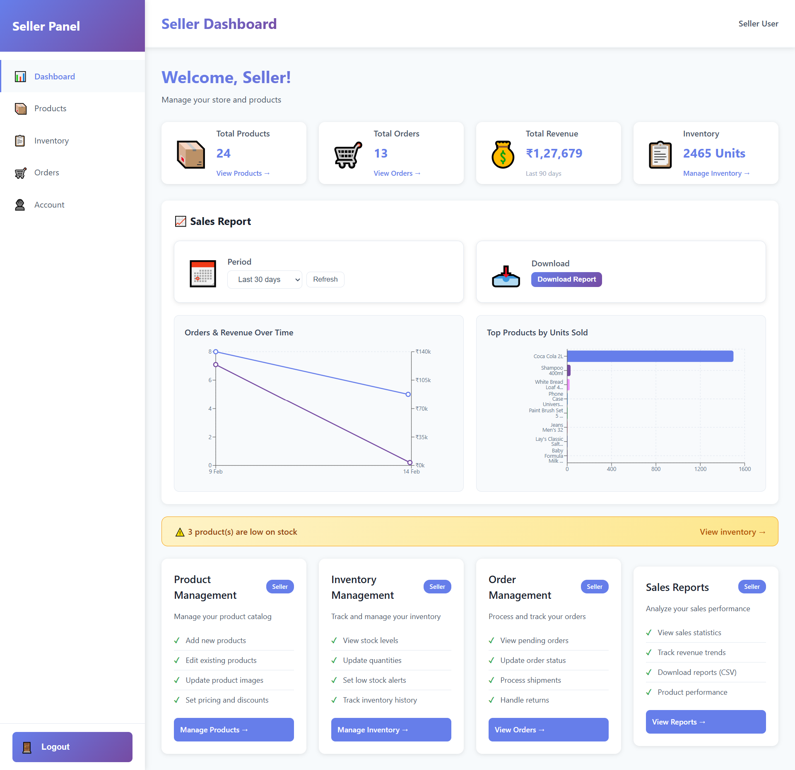
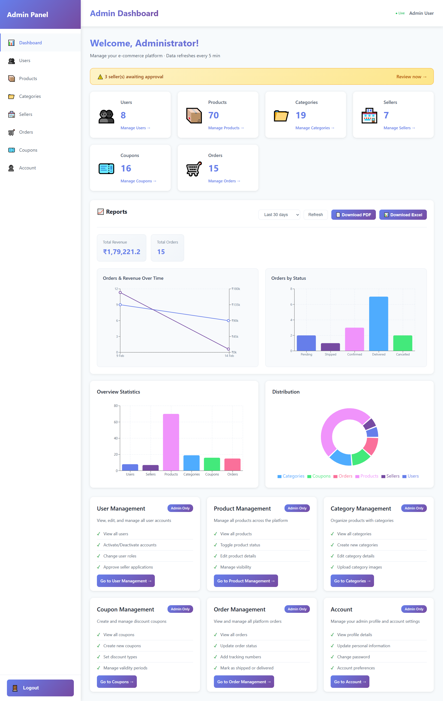
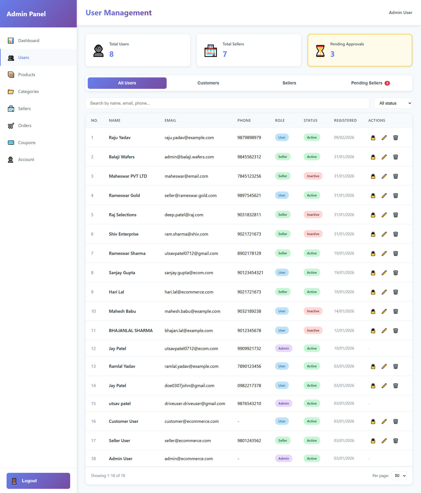

# E-Commerce Platform

Full-stack e-commerce application with **Customer**, **Seller**, and **Admin** roles. Built with ASP.NET Core 8 (backend) and React 19 + TypeScript + Vite (frontend).

---

## Features

### For Customers
- Browse products by category and search
- Shopping cart and checkout with address and coupon
- Order history with status filter (Pending, Confirmed, Shipped, Delivered, Cancelled)
- Order tracking and **download order bill (PDF)**
- Account: profile, addresses, security
- Customer dashboard with categories and products
- Email notifications: order placed, confirmed, cancelled, delivered

### For Sellers
- Seller dashboard with **Total Products**, **Total Orders**, **Total Revenue**, **Inventory** cards
- Product management (CRUD)
- Inventory management (stock, low-stock alerts)
- Order management (view, update status, tracking number)
- **Sales report**: period 7d / 30d / 90d / 6 months / 1 year, **Download Report (CSV)**
- Charts: Orders & Revenue over time, Top products by units sold

### For Admins
- Admin dashboard with stats and reports
- **User management**: list, search, filter, **edit customer/seller email**, activate/deactivate, approve/reject sellers
- Category and product management
- Order management (view, update status)
- Coupon management (CRUD)
- **Reports**: period 7d / 30d / 90d / **6 months** / **1 year**
- **Download PDF** and **Download Excel (CSV)** for admin reports

### General
- JWT authentication and role-based routing
- Forgot / Reset password (OTP via email)
- Scroll to top on every page/section navigation
- Responsive layout and toast notifications

---

## Screenshots

Place screenshot files in **`docs/screenshots/`** using the filenames below. They will appear in this README once added.

**Home – Landing page**


**Products – Listing and filters**


**Customer Dashboard**


**Cart**


**Order History (Customer)**


**Seller Dashboard – Stats and reports**


**Admin Dashboard**


**Admin – User management**


**Filenames to use:** `home.png`, `products.png`, `customer-dashboard.png`, `cart.png`, `orders.png`, `seller-dashboard.png`, `admin-dashboard.png`, `admin-users.png`

---

## Project Structure

```
AI_Workshop/
├── backend/                 # ASP.NET Core 8 API
│   ├── ECommerce.API/       # Controllers, middleware
│   ├── ECommerce.Application/
│   ├── ECommerce.Core/
│   ├── ECommerce.Infrastructure/
│   └── README.md           # Backend setup & API overview
├── frontend/                # React 19 + Vite
│   ├── src/
│   └── README.md           # Frontend setup & features
├── docs/
│   └── screenshots/        # Add app screenshots here
└── README.md               # This file
```

---

## Getting Started

### Prerequisites
- **.NET 8 SDK**
- **Node.js 18+** and npm
- **SQL Server** (or LocalDB / SQL Express)

### Backend
```bash
cd backend
# Set connection string in ECommerce.API/appsettings.json
dotnet restore
dotnet ef database update --project ECommerce.Infrastructure --startup-project ECommerce.API
dotnet run --project ECommerce.API
```
API runs at `https://localhost:7xxx` (see launchSettings.json). Swagger: `/swagger`.

### Frontend
```bash
cd frontend
# Optional: create .env with VITE_API_BASE_URL=http://localhost:7xxx
npm install
npm run dev
```
App runs at `http://localhost:5173`. Set `VITE_API_BASE_URL` to your backend URL if different.

### Default / Seed Data
If the backend uses a seeder, default users (e.g. admin, seller, customer) may be created on first run. Check `ECommerce.Infrastructure/Data/DbSeeder.cs` and configuration.

---

## Documentation

- **Backend**: [backend/README.md](./backend/README.md) – API list, configuration, migrations
- **Frontend**: [frontend/README.md](./frontend/README.md) – Routes, features, scripts

---

## License

Private / internal use unless otherwise stated.
